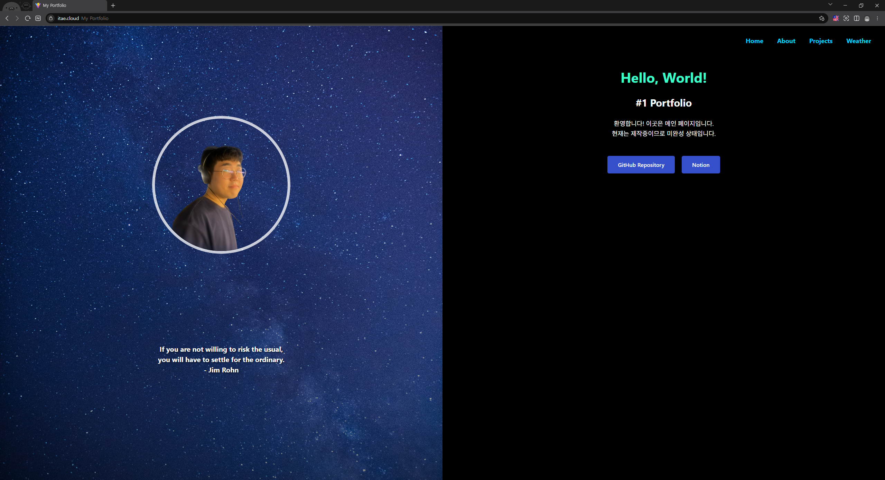
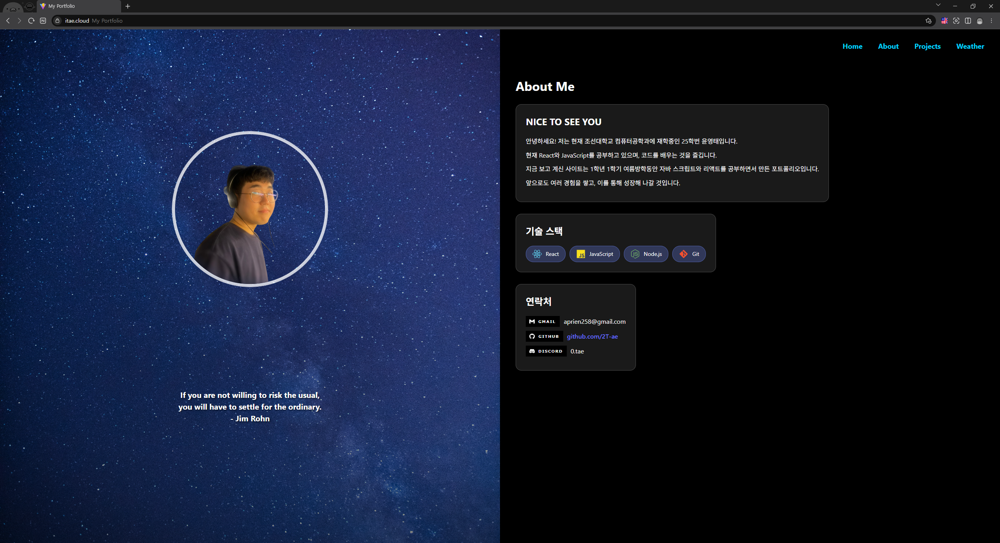
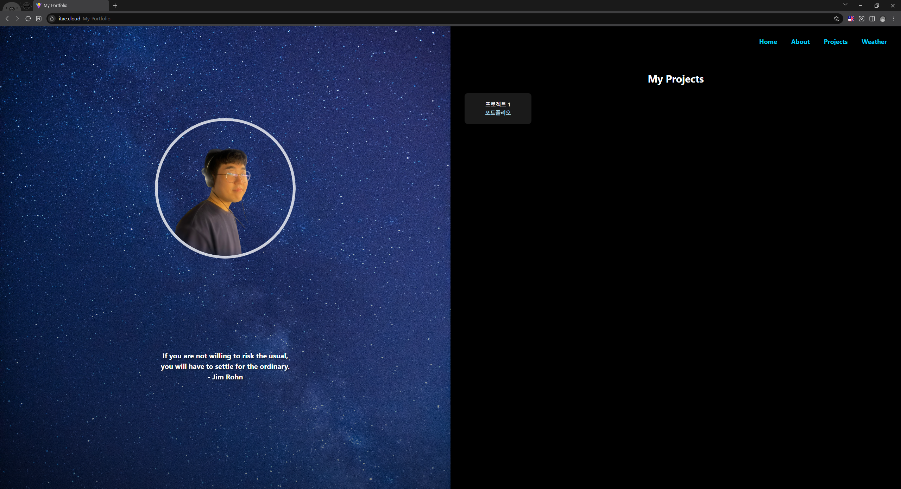
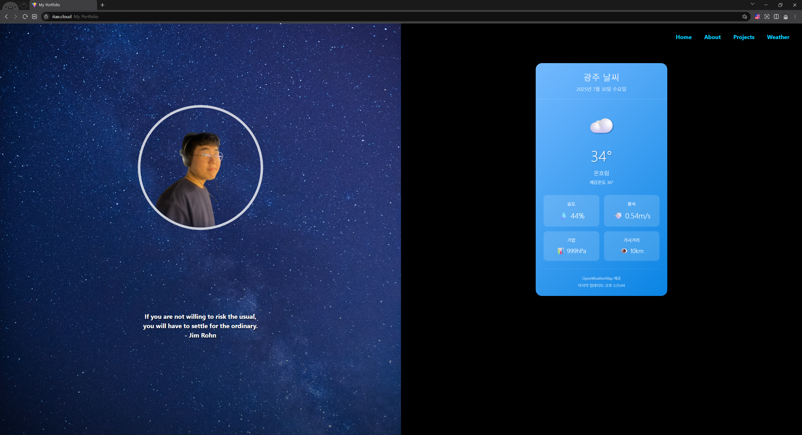

# PORTFOLIO (with React + Vite)

여름방학동안 새로운 언어를 배워보고자 포트폴리오 프로젝트를 진행하였고 그에 대한 레포지토리입니다.  
Link: [www.itae.cloud](https://www.itae.cloud/)

## 구성
- Home 탭에서는 이 레포지토리나 노션에 방문할 수 있는 버튼이 만들어져 있습니다.
- About 탭에서는 저에 대한 소개와 기술 스택, 연락할 수 있는 수단이 적혀 있습니다.
- Projects 탭에서는 진행한 프로젝트에 대한 것들을 추가해 나갈 예정입니다. 현재는 이 프로젝트만 올라가 있습니다.
- Weather 탭에서는 광주의 현재 기상 정보를 확인할 수 있습니다. 이는 더 다듬어 나갈 예정입니다.

## Page

